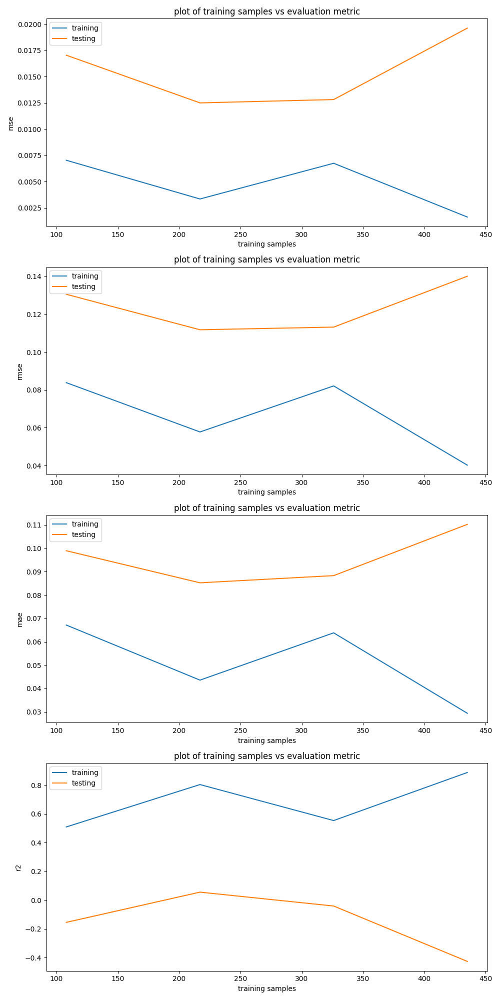
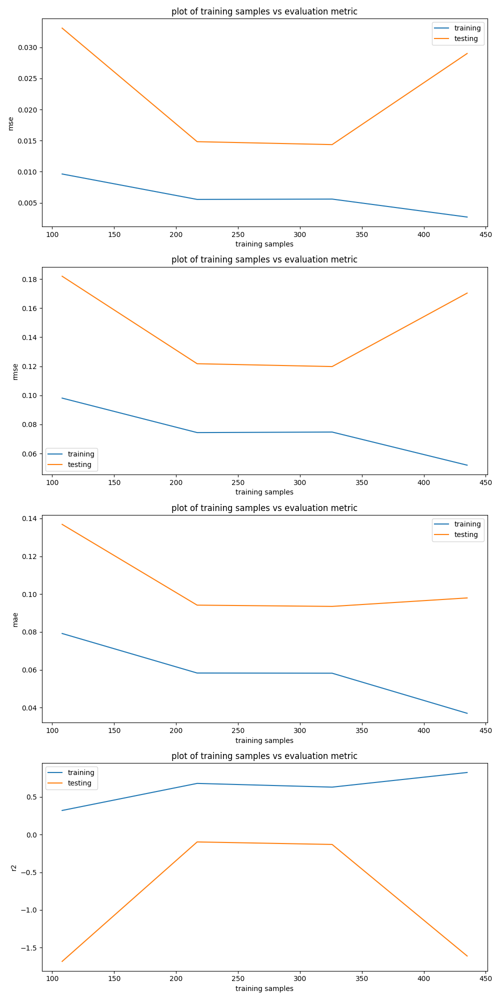

# RL assignment 1 Report

## This github repo is for CPSC 589 Spring '24 HW1

### Collaborators

Ziyao Shangguan

Chuhan Li

Anushka Potdar

### Behaviors to learn

1. Go directly to the Goal
2. Go to the Goal but avoid the Decoys
3. Go to the Goal but is attracted to the Decoys

### Algoithm picked

#### [TAMER](https://www.researchgate.net/publication/220916820_Interactively_shaping_agents_via_human_reinforcement_the_TAMER_framework) framework

Tamer aims to predict human reward given the oneline human feedback, then using the reward to guide the robot's behavior. For this assignment, I would use MLP to replace the ReinModel provided in the pseudocode. Further, since we already have demonstration data, I will seperate the training and executing process. In other words, I will first do an offline training on human rewards for given demonstrations, then using the trained model to guide robot's behavior.

#### [Bayesian IRL](https://www.researchgate.net/publication/220815343_Bayesian_Inverse_Reinforcement_Learning) 

Bayesian IRL aims to generate a probability distribution over the sapce of reward functions using Inverse Reinforcement Learning. In other words, this method focuses on inferring $P(reward | Demonstration)$. However, BIRL assumes that the expert has the attention to maximize the reward function of the given behavior, and since the provided demonstrations do not explicitly exhibit behaviors such as object avoiding, I will slightly modify the BIRL to make it suitable for my task. First, I assume $P(reward)$ and $P(D)$ is uniform, so that I only need to calculate $P(Demonstration | reward)$. Second, since I've already assigned human reward for all the demonstrations from previous task, I can approximate $P(Demonstration| reward)$ by using the expert reward (the ground truth $\hat{R}$) and the proposed reward ($\tilde{R}$). In my case, $P(Demonstration| reward) = e^{-(\hat{R} - \tilde{R})^2}$. Since the expert reward only covers states that is in the demonstration, I would need to train an MLP that could generate expert reward for all the states. Lastly, the robot will need to do online approximation of $\hat{R}$ using $\tilde{R}$, and use $\tilde{R}$ to guide its behavior.

#### Comparison

Both TAMER and BIRL are trying to approximate expert's reward for state-action pairs. However, BIRL focuses on the exact reward given by the expert, while BIRL focuses on inferring unknown reward from demonstration in a probabilistic way.

I choose these two algorithms because I want to compare the performance of RL and IRL in general.

For this specific assignment, I believe TAMER will have better performance, since TAMER only cares about human reward to different states and does not rely on expert's demonstration. In comparison, BIRL has the assumption that the expert demonstration tries to maximize the unknown reward function, which is not suitable for this task where I want to train the robot to learn new behaviors that's not demonstrated by the expert.

### Feedback to the trajectories

First, I convert the joint-space poses to end-effector poses, and record it as [here](eefPlanning).

Then, Let $G$ be the goal position, $E$ be the end-deffector position, and $D_i$ be the $i$ th decoy position, I assign reward to different states for different behaviors as follow:

1. Behavior 1: $e^{-\sqrt{(G - E)^2}}$
2. Behavior 2: $e^{-(\sqrt{(G - E)^2} - 0.2 \sum_i \sqrt{(D_i - E)^2})}$
3. Behavior 3: $e^{-(\sqrt{(G - E)^2} + 0.2 \sum_i \sqrt{(D_i - E)^2})}$

This reward make sense since it grows as the end-effector approaches the goal or attractors, and it decreases when the end-effector approaches the obstacles.

However, there's one problem: the recorded end-effector position is with respect to the robot's base, and the recorded Goal and Deocy position is with respect to the world.

Thus, using Gazebo, I figured out Robot's base position with respect to the World is: $[-0.2, -0.5, 1.021]$

And by applying transforms, end-effector position with respect to the world is: $[-0.2 - \text{end-effector pos wrt robot base}.y, -0.5 + \text{end-effector pos wrt robot base}.x, 1.021 + \text{end-effector pos wrt robot base}.z]$

Table below is the recorded Goal and Decoy positions in different environments

|Env, Goal, Decoy| pos.x w.r.t the world | pos.y       | pos.z      |
|:--------------:|:---------------------:|:-----------:|:----------:|
|Env 1, Goal 1   |-0.035		 |0.142        |1.245	    |
|Env 1, Goal 2   |-0.15			 |0.142	       |1.245       |
|Env 1, Goal 3   |-0.266		 |0.142	       |1.245       |
|Env 1, Goal 4   |-0.383		 |0.142        |1.245	    |
|Env 1, Decoy 1  |-0.383379              |0.165331     |1.14576     |
|Env 1, Decoy 2  |-0.183635		 |0.239076     |1.31077     |
|Env 1, Decoy 3  |-0.153111              |0.110957     |1.29395     |
|Env 1, Decoy 4  |0.022497	  	 |0.180345     |1.1708      |
|Env 2, Goal 1   |-0.035		 |0.042        |1.345	    |
|Env 2, Goal 2   |-0.15			 |0.042	       |1.245       |
|Env 2, Goal 3   |-0.266		 |0.142	       |1.345       |
|Env 2, Goal 4   |-0.383		 |0.042        |1.245	    |
|Env 2, Decoy 1  |-0.416498              |0.078665     |1.32583     |
|Env 2, Decoy 2  |-0.196313		 |0.310306     |1.34149     |
|Env 2, Decoy 3  |-0.133594              |0.184351     |1.34316     |
|Env 2, Decoy 4  |-0.074792	  	 |0.148929     |1.43017     |
|Env 3, Goal 1   |-0.035		 |0.042        |1.145	    |
|Env 3, Goal 2   |-0.15			 |0.142	       |1.245       |
|Env 3, Goal 3   |-0.266		 |0.142	       |1.245       |
|Env 3, Goal 4   |-0.383		 |0.042        |1.145	    |
|Env 3, Decoy 1  |-0.344683              |0.024459     |1.20518     |
|Env 3, Decoy 2  |-0.16924		 |0.226221     |1.2826      |
|Env 3, Decoy 3  |-0.099357              |0.12819      |1.32999     |
|Env 3, Decoy 4  |-0.024455	  	 |0.073603     |1.2148      |

### Training and Testing result

#### TAMER

As we can see from the evaluation, the performance of the model gets better with more training samples. However, we can see the sign of overfitting when training with more training samples.

#### BIRL

As we can see from the evaluation, the performance of the model gets better with more training samples. In general, I would recommend BIRL if we want the robot to simply learn what is demonstrated by the human expert, and under the situations where $P(\text{Demonstration} | \text{reward})$ is easy to calculate.

#### Conclusion

The actual performance of the robot is shown in the recording **[screen recording](ComleteFailure.webm)**. Sadly, the robot does not perform as I wish it could, mainly because the training samples are too sparse among the state space. The model overfits to the provided demonstration, and thus failed to generate reward to unseen states.

# ReadMe

* The **[assign_reward](assign_reward)** folder contains the code to assign reward to end-effector trajectories. The assigned rewards are saved inside the **[reward](reward)** folder.
* The **[bayesianIRL](bayesianIRL)** folder contains 4 models that trained with different training size (108, 217, 326, 435 samples). Each model takes in 18 numbers as input, and output 3 numbers that correspond to the rewards calculated for 3 different behaviors. **[bayesianIRL.py](bayesianIRL/bayesianIRL.py)** contains the code to run the BIRL policy. **[display.py](bayesianIRL/display.py)** contains the code to display the training and testing evaluation. **[train.py](bayesianIRL/train.py)** contains the code that trains the model.
* The **[config](config)** folder contains the simulation models.
* The **[planning](planning)** folder contains the code to run the simulation and execute the expert trajectory. I modified the code inside **[xarmJointPlanningClient.py](planning/xarmJointPlanningClient.py)** so that it can save the end-effector position to **[eefPlanning](eefPlanning)** while executing the expert's trajectory.
* The **[tamer](tamer)** folder contains 4 models that trained with different training size (108, 217, 326, 435 samples). Each model takes in 18 numbers as input, and output 3 numbers that correspond to the rewards calculated for 3 different behaviors. **[tamer.py](tamer/tamer.py)** contains the code to run the TAMER policy. **[display.py](tamer/display.py)** contains the code to display the training and testing evaluation. **[train.py](tamer/train.py)** contains the code that trains the model.

